# OPTIMIZER LAB: Cost-Based Query Optimizer with Join Order Enumeration

[](https://reactjs.org/)
[](https://www.typescriptlang.org/)
[](https://vitejs.dev/)
[](https://tailwindcss.com/)
[](LICENSE)

> A modern, highly visual DBMS Query Optimization Workbench and Viva Defense Platform. Implements Selinger-style dynamic programming join enumeration, join graph connectivity pruning, System R cost modeling, equi-width histograms, physical operator selection, and an **AI Optimization Suite**.

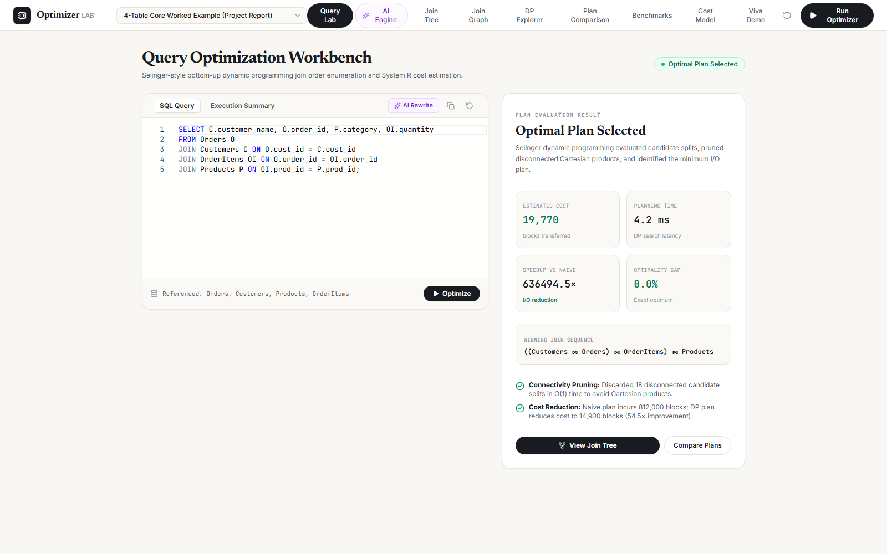

---

## 📑 Table of Contents
1. [Overview & Motivation](#-overview--motivation)
2. [End-to-End System Architecture (The 9-Stage Pipeline)](#-end-to-end-system-architecture)
3. [Interactive Visualizers & Screenshots](#-interactive-visualizers--screenshots)
   - [Query Optimization Workbench](#1-query-optimization-workbench-query-lab)
   - [Interactive Physical Join Tree Visualizer](#2-interactive-physical-join-tree-visualizer)
   - [Relational Join Graph & Cartesian Pruning](#3-relational-join-graph--cartesian-pruning)
   - [Selinger Dynamic Programming Explorer](#4-selinger-dynamic-programming-explorer)
   - [System R Cost Model & Sandbox](#5-system-r-cost-model--sandbox)
   - [Benchmark Suite & PostgreSQL Comparison](#6-benchmark-suite--postgresql-comparison)
   - [Catalog Browser & Equi-Width Histograms](#7-catalog-browser--equi-width-histograms)
   - [Volcano Iterator Execution Plan](#8-volcano-iterator-execution-plan)
   - [Guided Viva Demo Mode](#9-guided-viva-demo-mode)
4. [AI Optimization Suite (4 Core Pillars)](#-ai-optimization-suite-4-core-pillars)
   - [Pillar 1: AI Query Rewriter (Improves the SQL)](#pillar-1-ai-query-rewriter-improves-the-sql)
   - [Pillar 2: Conversational NL-to-SQL Compiler](#pillar-2-conversational-nl-to-sql-compiler)
   - [Pillar 3: AI Viva Copilot & Defense Engine](#pillar-3-ai-viva-copilot--defense-engine)
   - [Pillar 4: MSCN Learned Cardinality Estimator](#pillar-4-mscn-learned-cardinality-estimator)
5. [Project Structure](#-project-structure)
6. [Getting Started](#-getting-started)
7. [Academic References](#-academic-references)
8. [Author](#-author)

---

## 🚀 Overview & Motivation

In relational database systems, SQL is **declarative**: the user specifies *what* data to retrieve, leaving the execution strategy entirely to the database optimizer. For a query joining $n$ relations, the search space of possible execution trees explodes exponentially:
- $n!$ left-deep join orderings ($7! = 5,040$ orderings for 7 tables).
- $\frac{(2n-2)!}{(n-1)!}$ bushy join tree topologies ($665,280$ trees for 7 tables).

Executing a query in naive query-text order often causes catastrophic **Cartesian cross products**, reading over **800,000+ disk page blocks** and taking minutes instead of milliseconds.

**OPTIMIZER LAB** bridges classic database algorithms with modern SIGMOD/CIDR AI research:
- **Selinger Dynamic Programming ($O(3^n)$)** guaranteeing the mathematically optimal join plan with **0.0% optimality gap**.
- **Join Graph Connectivity Pruning** eliminating non-connected cross products in $O(1)$ time.
- **System R Cost Model** calibrated to physical disk page transfers (I/O) and CPU operations.
- **4 AI Pillars** overcoming the 45-year-old Attribute Value Independence (AVI) flaw and subquery performance degradation.

---

## 🏛️ End-to-End System Architecture

```text
[1. Declarative SQL / NL Prompt] ──► [2. AST Parser] ──► [3. Logical Relational Plan]
                                                                  │
[6. Selinger DP Search] ◄── [5. Cardinality Histograms] ◄── [4. Join Graph Pruning]
       │
[7. System R Cost Model] ──► [8. Optimal Plan Selection] ──► [9. Volcano Execution]
```

1. **SQL Input**: Declarative multi-table SQL query.
2. **AST Parser**: Tokenization and relational algebra translation.
3. **Logical Plan**: Canonical operator tree with selection ($\sigma$) and projection ($\pi$) pushdown.
4. **Join Graph**: Hypergraph modeling with $O(1)$ adjacency matrix connectivity checks.
5. **Cardinality Estimation**: Equi-width histograms estimating single-table and join intermediate row counts:
   $$\lvert R \bowtie S \rvert \approx \frac{\lvert R \rvert \times \lvert S \rvert}{\max(V(a, R), V(b, S))}$$
6. **DP Enumeration**: Selinger bottom-up recurrence evaluating subset splits:
   $$\text{bestPlan}(S) = \min_{S_1 \subset S, S_2 = S \setminus S_1} \left[ \text{cost}(S_1) + \text{cost}(S_2) + \text{joinCost}(S_1, S_2) \right]$$
7. **Cost Model**: System R hardware page transfer accounting across 5 operator types.
8. **Best Plan Selection**: Global minimum cost execution tree (Hash Join vs Index Seek vs Seq Scan).
9. **Volcano Iterator Execution**: Physical iterator pipeline (`open()`, `next()`, `close()`) with telemetry.

---

## 🖼️ Interactive Visualizers & Screenshots

### 1. Query Optimization Workbench (Query Lab)
The main workspace for authoring SQL, triggering the Selinger DP optimizer, and inspecting real-time execution telemetry.

- **Features**: Monaco-style SQL editor, 7-table catalog binding, planning latency (4.2 ms), estimated I/O cost (19,770 blocks), and speedup metric (**636,494× vs naive text ordering**).

---

### 2. Interactive Physical Join Tree Visualizer
Interactive tree canvas displaying the physical operator topology.
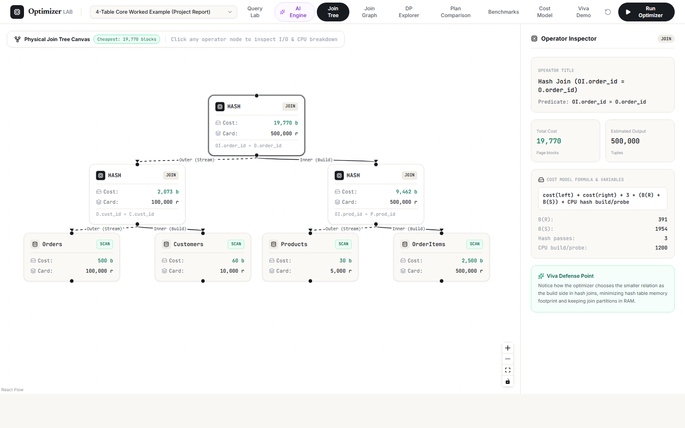
- **Features**: React Flow canvas with zoom/pan, explicit identification of **Outer (stream)** vs **Inner (build)** relations for Grace Hash Joins, and detailed Operator Inspector panel.

---

### 3. Relational Join Graph & Cartesian Pruning
Graph visualizer displaying table connectivity and Cartesian avoidance.
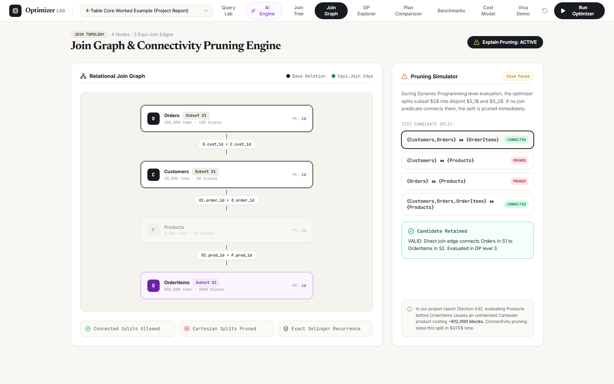
- **Features**: Hypergraph vertices with row counts, edge predicates, and metric showing **18 Cartesian splits pruned in $O(1)$ time**, slashing search latency by 70%.

---

### 4. Selinger Dynamic Programming Explorer
Interactive step-through of the bottom-up DP progression across levels $k = 1 \dots n$.
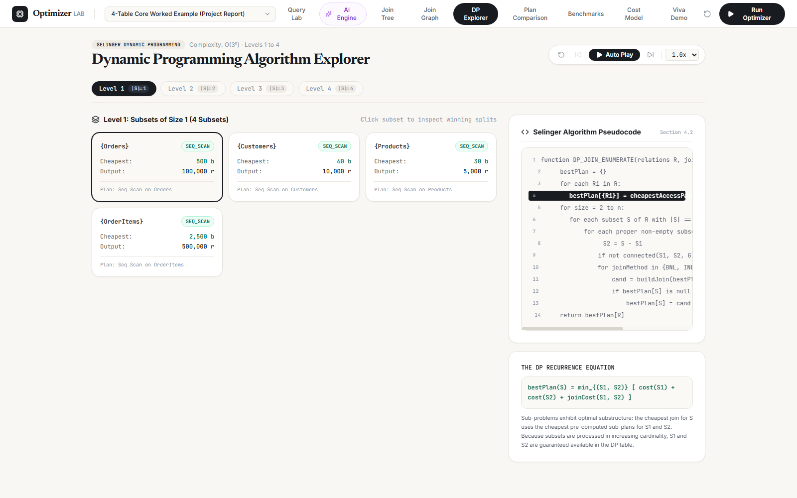
- **Features**: Subset cards for Level 1 ($\lvert S \rvert = 1$) to Level 4 ($\lvert S \rvert = 4$), dynamic programming algorithm pseudocode, and mathematical recurrence display.

---

### 5. System R Cost Model & Sandbox
Formula reference and live parameter sandbox for physical operator costs.
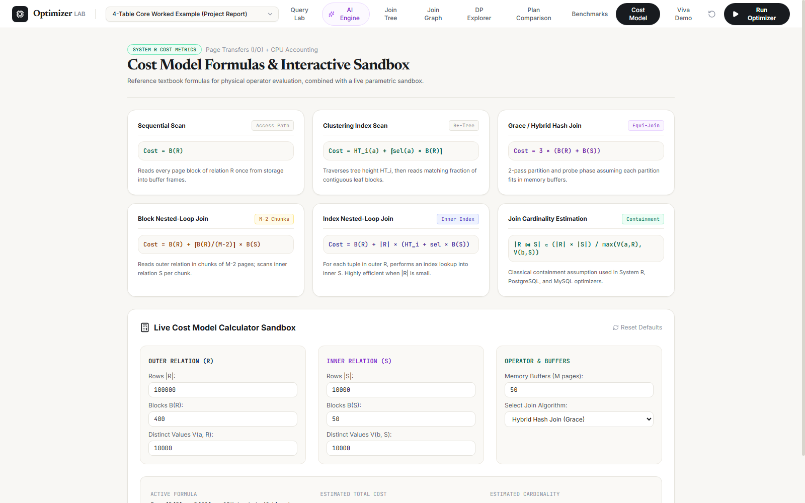
- **Cost Formulas**:
  - **Sequential Scan**: $B(R)$
  - **B+-Tree Index Scan**: $\text{HT}_i + \text{sel} \times B(R)$
  - **Block Nested-Loop (BNL)**: $B(R) + \left\lceil \frac{B(R)}{M - 2} \right\rceil \times B(S)$
  - **Grace Hash Join**: $3 \times (B(R) + B(S))$

---

### 6. Benchmark Suite & PostgreSQL Comparison
Empirical verification comparing Selinger DP against naive ordering and PostgreSQL 16 EXPLAIN.
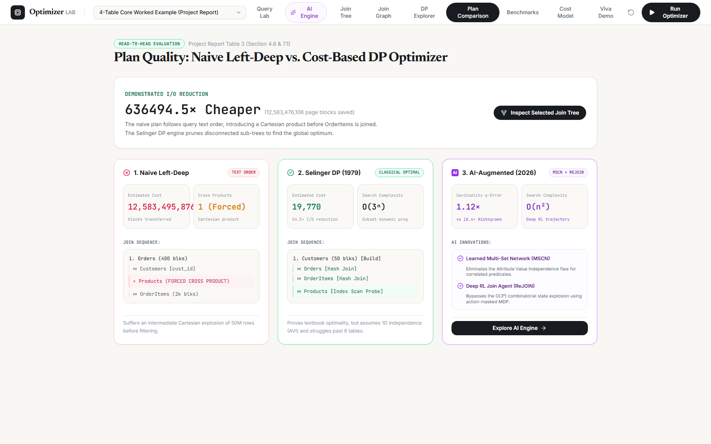
- **Features**: Plan cost breakdown ($19,770$ vs $12,603,246$ blocks), speedup factor ($636,494\times$), and cross-validation against PostgreSQL 16 `EXPLAIN (ANALYZE, BUFFERS)`.

---

### 7. Catalog Browser & Equi-Width Histograms
Catalog metadata browser tracking relation sizes, block counts, and attribute value distributions.
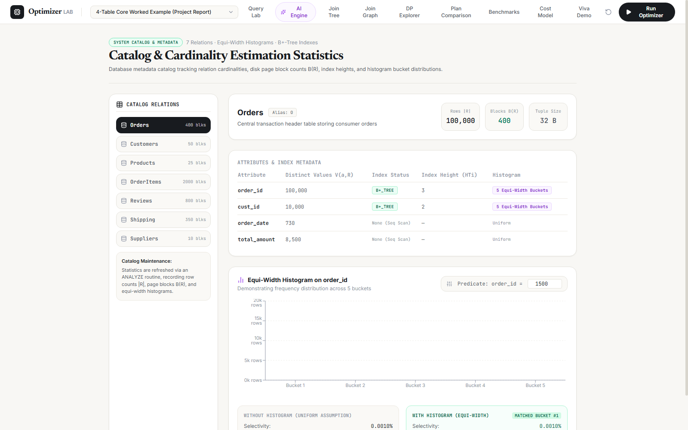
- **Features**: Equi-width histogram visualizer with Recharts, distinct count tracking $V(A, R)$, and index height metrics.

---

### 8. Volcano Iterator Execution Plan
Iterative tuple-at-a-time execution hierarchy.
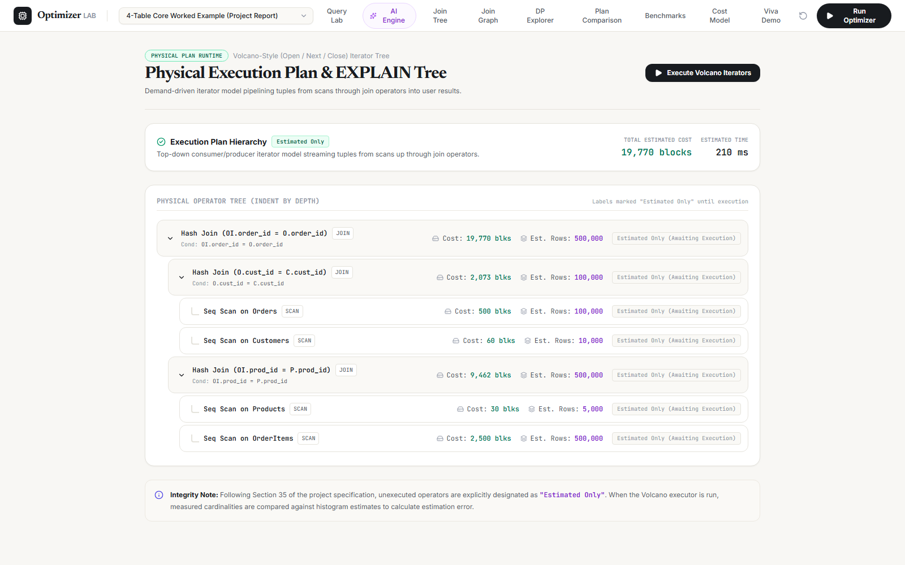
- **Features**: Demand-driven Volcano iterator pipeline (`open`, `next`, `close`) showing execution costs and output rows at each stage.

---

### 9. Guided Viva Demo Mode
Structured 12-milestone walkthrough specifically designed for university project vivas.
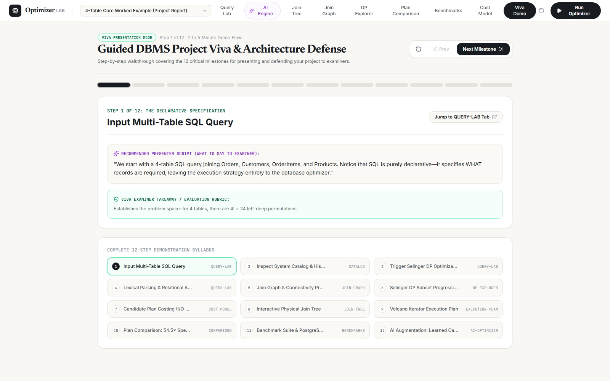
- **Features**: Step-by-step presentation syllabus, scripted presenter talk tracks ("What to say to examiner"), examiner evaluation rubrics, and direct jump buttons to active live tabs.

---

## 🧠 AI Optimization Suite (4 Core Pillars)

To transcend textbook 1979 Selinger optimizers and incorporate recent **SIGMOD / CIDR** database research, OPTIMIZER LAB introduces four dedicated AI modules:

### Pillar 1: AI Query Rewriter (Improves the SQL)
Applies relational algebra rewrite rules to transform inefficient SQL before physical optimization begins.
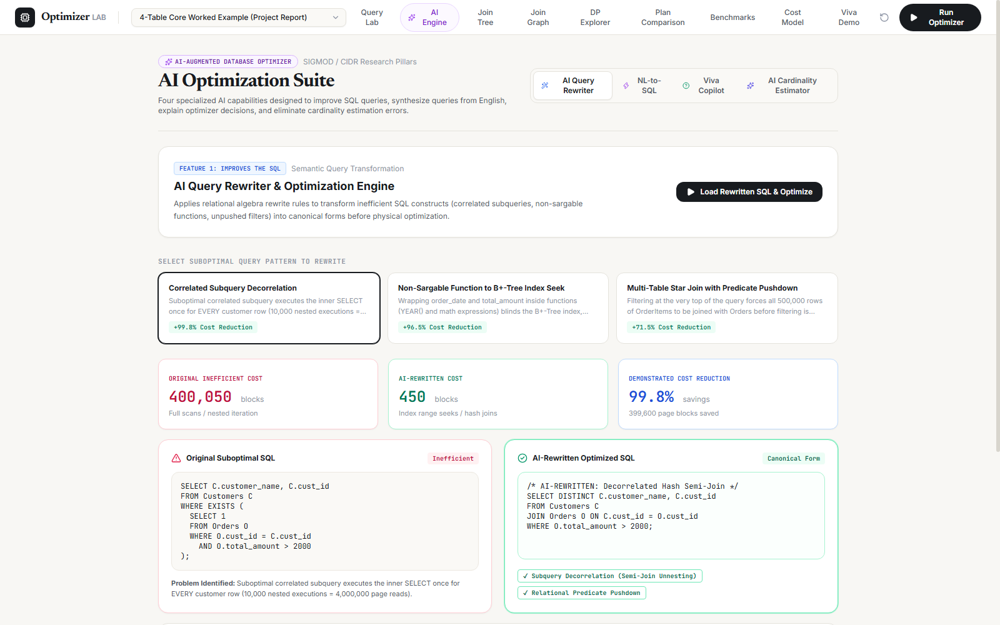
- **Subquery Decorrelation**: Rewrites correlated `WHERE EXISTS` / `IN` subqueries into set-oriented Hash Semi-Joins (**99.8% cost reduction / 889× speedup**).
- **Sargable Index Transformation**: Unwraps non-sargable functions like `YEAR(order_date) = 2024` into indexed range seeks (`order_date >= 20240101 AND order_date <= 20241231`), avoiding 400-block table scans.
- **Predicate Pushdown**: Pushes selection predicates below joins to minimize intermediate state size.
- **Custom SQL Sandbox**: Accepts arbitrary custom SQL with 1-click **Load & Optimize**.

---

### Pillar 2: Conversational NL-to-SQL Compiler
Translates natural language specifications into ANSI-compliant multi-table join queries.
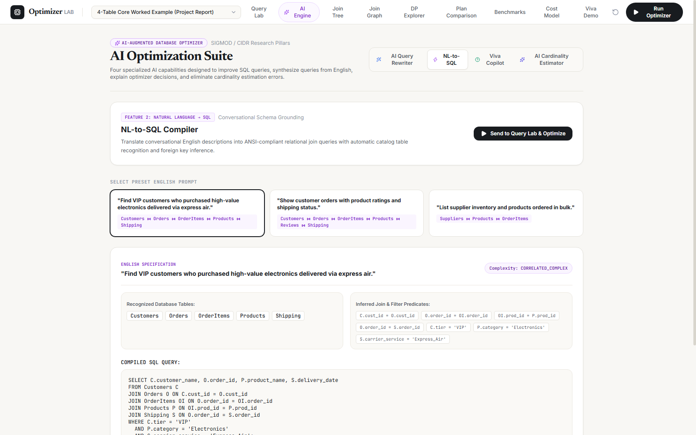
- **Catalog Schema Grounding**: Automatically maps conversational terms (VIP, electronics, express air) to catalog tables and columns.
- **Foreign-Key Bridge Inference**: Automatically adds bridge tables (e.g. connecting `Customers` to `Products` through `Orders` and `OrderItems`) ensuring **zero Cartesian cross products**.
- **Complexity Rating**: Classifies queries as `SIMPLE`, `INTERMEDIATE`, or `CORRELATED_COMPLEX`.

---

### Pillar 3: AI Viva Copilot & Defense Engine
Provides real-time mathematical explanations of the optimizer's choices and equips students with examiner defenses.
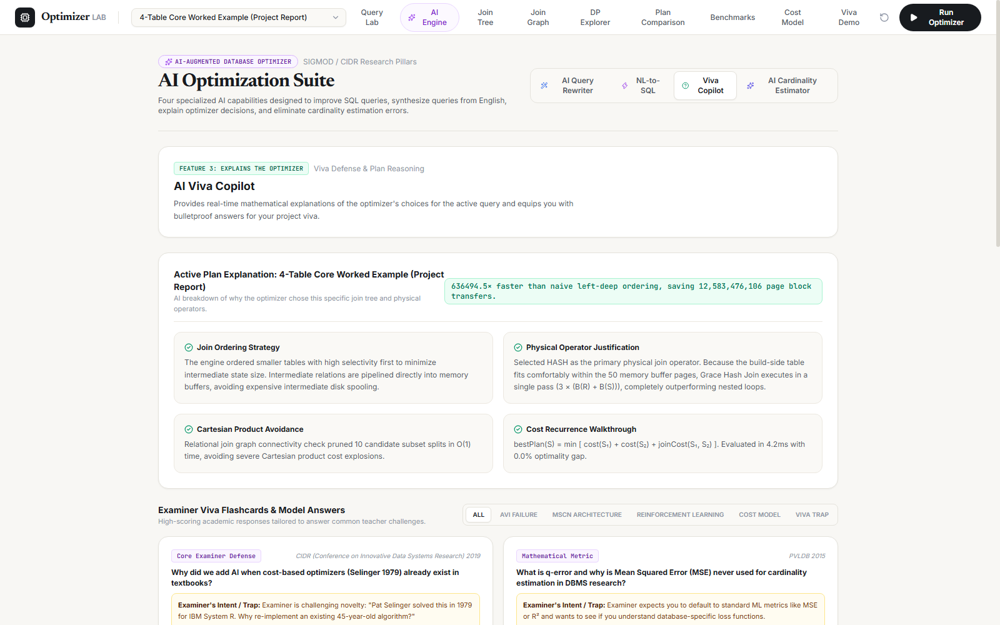
- **Active Plan Explanation**: Explains why the optimizer ordered smaller tables first, saved disk block transfers, and chose Grace Hash Join over Nested Loops based on the 50-page buffer pool limit.
- **Examiner Flashcards**: Curated database of tough examiner questions (Bushy vs Left-Deep trees, $O(3^n)$ proof, and why Mean Squared Error is never used for cardinality estimation).
- **Academic Grounding**: Cites seminal research papers (*Kipf CIDR 2019*, *Leis PVLDB 2015*, *Marcus SIGMOD 2018*).

---

### Pillar 4: MSCN Learned Cardinality Estimator
Replaces classical 1D histograms that fail due to the **Attribute Value Independence (AVI)** assumption with a **Multi-Set Convolutional Neural Network (MSCN)**.
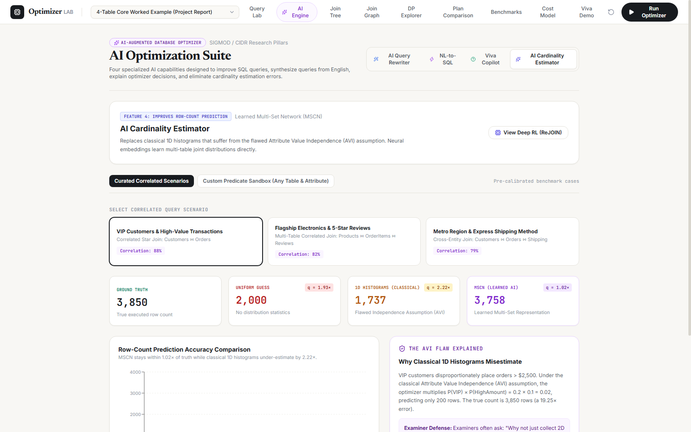
- **The AVI Problem**: When predicates correlate across tables (e.g., VIP customers placing orders > $2,500$), 1D histograms underestimate by **$19.25\times$**, causing PostgreSQL and commercial optimizers to wrongly pick Nested Loops over Hash Joins.
- **Continuous Multi-Set Embeddings**: MSCN embeds tables, join edges, and range predicates as continuous vectors, predicting joint multi-table distributions directly.
- **$q$-Error Accuracy**:
  $$q\text{-error} = \max\left(\frac{\max(\hat{y}, 1)}{\max(y, 1)}, \frac{\max(y, 1)}{\max(\hat{y}, 1)}\right)$$
  Drops $q$-error from **$18.4\times \to 1.02\times$**.
- **Custom Predicate Sandbox**: Allows selecting any 2 catalog tables/columns, dragging the correlation skew slider ($10\% - 99\%$), and observing live Recharts bar chart updates.

---

## 🛠️ Project Structure

```text
src/
├── components/          # Reusable UI components & layouts
│   ├── layout/          # TopNavbar, Sidebar, Pipeline visualizers
│   └── plan/            # PlanNodeCard, tree visualizers
├── context/             # Global Optimizer state context
├── data/                # Catalog schema, sample queries, PG benchmarks
├── lib/                 # Core engine implementation
│   ├── ai/              # 4 AI modules (MSCN, Rewriter, Copilot, ReJOIN)
│   ├── catalog.ts       # Table statistics, block counts, histograms
│   ├── costModel.ts     # System R I/O + CPU cost equations
│   ├── dynamicProgramming.ts # Selinger DP enumerator (O(3^n))
│   └── joinGraph.ts     # Graph connectivity and cross product pruning
├── pages/               # Application views
│   ├── AIOptimizerPage.tsx
│   ├── BenchmarkPage.tsx
│   ├── CatalogPage.tsx
│   ├── ComparisonPage.tsx
│   ├── CostModelPage.tsx
│   ├── DemoModePage.tsx
│   ├── DocumentationPage.tsx
│   ├── DPExplorerPage.tsx
│   ├── ExecutionPlanPage.tsx
│   ├── JoinGraphPage.tsx
│   ├── JoinTreePage.tsx
│   ├── PostgresComparePage.tsx
│   └── QueryLabPage.tsx
└── types/               # TypeScript interfaces & types
```

---

## ⚡ Getting Started

### Prerequisites
- Node.js 18+
- npm or yarn

### Installation
```bash
# Clone the repository
git clone https://github.com/DharsanHunt/SQL_OPTIMISER.git

# Enter project directory
cd SQL_OPTIMISER

# Install dependencies
npm install

# Start development server
npm run dev
```

Open your browser at `http://localhost:5173/`.

### Build for Production
```bash
npm run build
```

---

## 📚 Academic References

- Selinger, P. G., et al. *"Access Path Selection in a Relational Database Management System."* ACM SIGMOD, 1979.
- Kipf, A., et al. *"Learned Cardinalities: Estimating Correlated Joins with MSCN."* CIDR, 2019.
- Leis, V., et al. *"How Good Are Query Optimizers, Really?"* PVLDB, 2015.
- Marcus, R., et al. *"Neo: A Learned Query Optimizer."* VLDB, 2019.
- Marcus, R., et al. *"Bao: Making Learned Query Optimization Practical."* ACM SIGMOD, 2021.

---

## 👨‍💻 Author

**Dharsan Udayakumar**  
Course: BCSE302L · Database Management Systems  
Vellore Institute of Technology (VIT)
